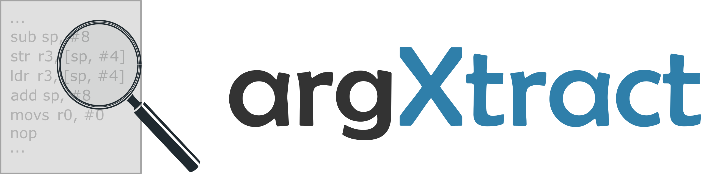

# argXtract
argXtract enables the extraction of arguments to *Calls of Interest* (SVC Calls and function calls (POC)) from stripped IoT binaries. 


## Requirements
Python 3.7+ (older versions will **not** work).

Install pre-requisites using `pip install -r requirements.txt`.

## Configuration
Even though the tracing and value analysis functionalities are generic, `argXtract` does not perform zero-knowledge analysis. Some vendor-specific information is required, and must be specified in a certain format. Details on how to do this are given in the [documentation](docs/vendor-config.md). We have provided example configurations for Nordic BLE and ANT+.


## Execution
```
usage: start.py [-h] (-d DIRECTORY | -f FILE | -l LIST) [-c [{c,e,w,i,d,t}]] [-b] [-t TIME] [-m MAX_CALL_DEPTH] -M
                [{s,f}] [-v VENDOR] [-p PROCESSES]]

argxtract enables testing stripped IoT firmware files to extract arguments to configuration constructs (such as Supervisor Calls or function calls).

optional arguments:
  -h, --help            show this help message and exit
  -d DIRECTORY, --directory DIRECTORY
                        directory containing firmware files to be analysed. Provide absolute path to directory as
                        argument.
  -f FILE, --file FILE  individual firmware file to be analysed.
  -l LIST, --list LIST  text file containing absolute paths of firmware files to be analysed.
  -c [{c,e,w,i,d,t}], --console [{c,e,w,i,d,t}]
                        console log level. One of c (critical), e (error), w (warning), i (info), d (debug), t
                        (trace).
  -b, --bypass          bypass all conditional checks.
  -t TIME, --time TIME  maximum trace time per file in seconds.
  -m MAX_CALL_DEPTH, --max_call_depth MAX_CALL_DEPTH
                        maximum call depth of a function to be included in trace.
  -M [{s,f}], --Mode [{s,f}]
                        analysis mode. Either s (SVC) or f (function).
  -v VENDOR, --vendor VENDOR
                        the vendor/chipset to test against. Vendor-specific files must be added to the repo.
  -p PROCESSES, --processes PROCESSES
                        number of parallel processes ("threads") to use.
```


## Output
An individual JSON file is generated per analysed file, and all such output JSONs are placed within the `output` directory. The SHA256 hash of the file is used as the name for the output file.

The structure of the output file is as below:
```
{
    "filepath": <>,
    "output": {...},
    "cois": [
        "coi1",
        "coi2"
    ],
    "unhandled": <any arguments encountered during trace that are not handled by argxtract>,
    "analysis_time": <in seconds>
}
```

## Example
Considering the `sd_ble_opt_set` SVCall, which enables setting a fixed passkey, we would specify the argument definition file as below:
```
{
    "args": {
        "0": {
            "in_out": "in",
            "ptr_val": "value",
            "length": 4,
            "data": {
                "opt_id": {
                    "ptr_val": "value",
                    "length_bits": 32,
                    "type": "uint32"
                }
            }
        },
        "1": {
            "in_out": "in",
            "ptr_val": "pointer",
            "length": 6,
            "data": {
                "p_opt": {
                    "ptr_val": "pointer",
                    "length_bits": 48,
                    "type": "hex"
                }
            }
        }
    }
}
```

A binary file that contained a call to this SVC (e.g., with a fixed passkey of 123456) would contain within its output:
```
 "output": {
    "sd_ble_opt_set": [
        {
            "opt_id": 34,
            "p_opt": "313233343536"
        }
    ]
 }
```
