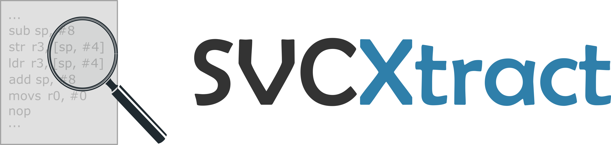

# SVCXtract
SVCXtract enables the extraction of arguments to SVC Calls from stripped IoT binaries. Vendor-specific customisation is required before the tool can be used.


## Requirements
Python 3.7+ (older versions will **not** work).

Install pre-requisites using `pip install -r requirements.txt`.

## Configuration
Even though the tracing and value analysis functionalities are generic, it does not perform zero-knowledge analysis. Some vendor-specific information is required, and must be specified in a certain format. Details on how to do this are given in the [documentation](docs/vendor-config.md).


## Execution
```
usage: start.py [-h] (-d DIRECTORY | -f FILE | -l LIST) [-c [{c,e,w,i,d,t}]] [-t TIME] [-m MAX_CALL_DEPTH] [-v VENDOR] 
                [-p PROCESSES]

optional arguments:
  -h, --help            show this help message and exit
  -d DIRECTORY, --directory DIRECTORY
                        directory containing firmware files to be analysed. Provide absolute path to directory as
                        argument.
  -f FILE, --file FILE  individual firmware file to be analysed.
  -l LIST, --list LIST  text file containing absolute paths of firmware files to be analysed.
  -c [{c,e,w,i,d,t}], --console [{c,e,w,i,d,t}]
                        console log level. One of c (critical), e (error), w (warning), i (info), d (debug), t
                        (trace).
  -t TIME, --time TIME  maximum trace time per file in seconds.
  -m MAX_CALL_DEPTH, --max_call_depth MAX_CALL_DEPTH
                        maximum call depth of a function to be included in trace.
  -v VENDOR, --vendor VENDOR
                        the vendor/chipset to test against. Vendor-specific files must be added to the repo.
  -p PROCESSES, --processes PROCESSES
                        number of parallel processes ("threads") to use.
```


## Output
An individual JSON file is generated per analysed file, and all such output JSONs are placed within the `output` directory. The SHA256 hash of the file is used as the name for the output file.

## Notes
SVCXtract avoids internal loops within the Reset Handler. Including these elements would not add much information in general, and would significantly increase analysis time. If there is a use case for including them, please let us know by raising an issue.